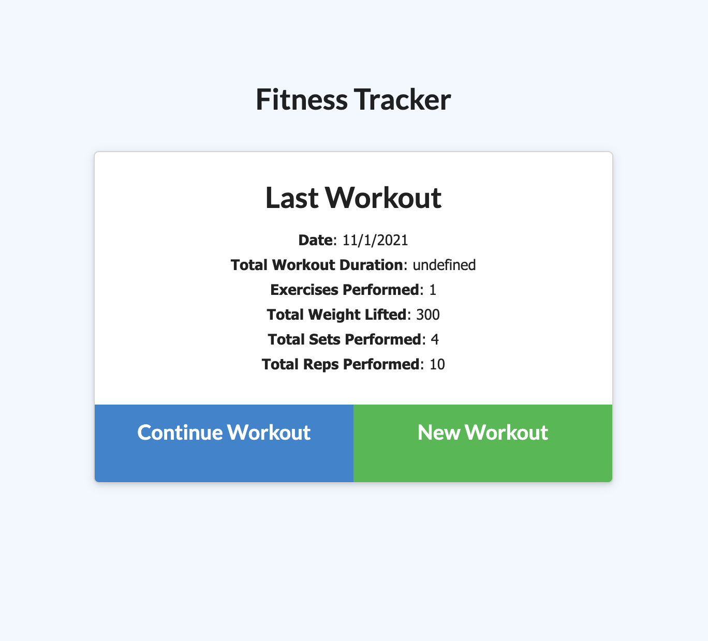

# train-me

  ## Table of Contents

  * [Description](#Description)

  * [Installation](#Installation)

  * [Usage](#Usage)

  ## Description:
      A fitness app for users to track their workouts. Create and edit workouts, add custom exercises, and see your progress!

  ## Installation:
    * Deployed Url: https://guarded-falls-94234.herokuapp.com/?id=61817bff0de6e60016439526

    * Github Repository: https://github.com/eliselabonte/train-me

  ## Usage:
      Access workout information all in one place in an organized database.